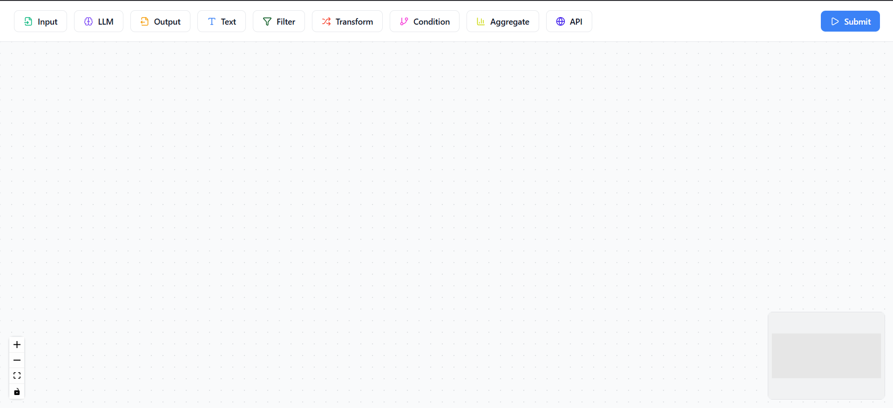
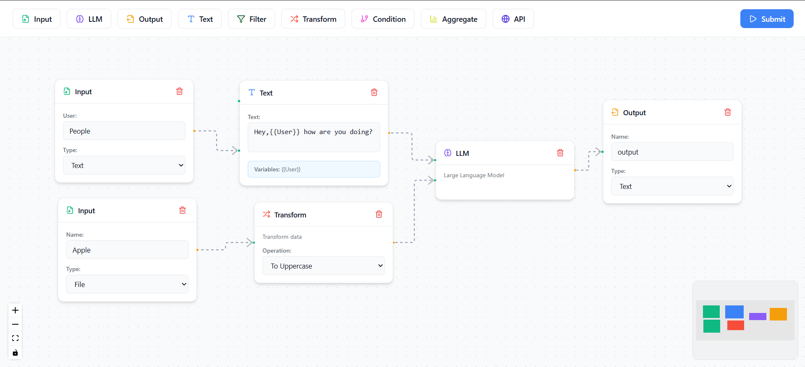
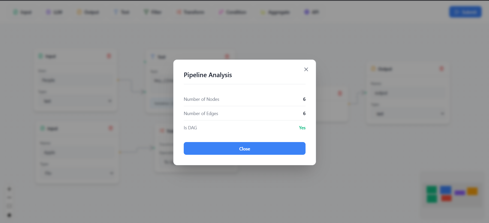

# AI Pipeline Builder 🚀

> A visual, drag-and-drop pipeline builder for creating and validating AI workflows. Build complex data processing pipelines with an intuitive node-based interface.

---

## Visual Showcase 📸

### Clean, Minimalist Interface
Start with a blank canvas and an intuitive toolbar of pre-built nodes:



### Build Complex Pipelines Visually
Connect nodes to create sophisticated AI workflows in minutes:



### Real-time Validation
Instantly validate your pipeline structure with built-in DAG (Directed Acyclic Graph) analysis:



---

## What is This? 🤔

**AI Pipeline Builder** is a modern web application that lets you visually design and validate AI/data processing pipelines. Instead of writing complex code or configuration files, you simply:

1. **Drag** nodes from the toolbar
2. **Drop** them onto the canvas
3. **Connect** them by drawing edges
4. **Configure** each node's parameters
5. **Validate** your pipeline with one click

Think of it as a visual programming environment specifically designed for AI workflows - perfect for rapid prototyping, teaching, or production pipeline design.

---

## Core Features ✨

### 🧩 **Rich Node Library**
9 pre-built node types for common AI/data operations:

| Node Type | Icon | Purpose |
|-----------|------|---------|
| **Input** | 📥 | Data source entry points |
| **Output** | 📤 | Final results destination |
| **LLM** | 🧠 | Large Language Model processing |
| **Text** | 📝 | Text templates with variables |
| **Filter** | 🔍 | Data filtering operations |
| **Transform** | 🔄 | Data transformation logic |
| **Condition** | 🌿 | Conditional branching |
| **Aggregate** | 📊 | Data aggregation/grouping |
| **API** | 🌐 | External API calls |

### 🎯 **Smart Text Node**
The Text node has special powers:
- Type `{{variableName}}` anywhere in your text
- Input nodes are **automatically created** for each variable
- Connections are **auto-established**
- Variables are **tracked and displayed** in real-time

**Example:**
```
Text: "Hello {{name}}, you are {{age}} years old and live in {{city}}"
Result: 3 Input nodes automatically created and connected!
```

### ✅ **Pipeline Validation**
- **DAG Detection**: Ensures your pipeline is a valid Directed Acyclic Graph
- **Cycle Prevention**: Detects and reports circular dependencies
- **Real-time Feedback**: Instant validation results in a clean modal

### 🎨 **Professional Design**
- **Tailwind CSS**: Modern, utility-first styling
- **Lucide Icons**: Beautiful, consistent iconography
- **Color-Coded**: Each node type has its own color scheme
- **Smooth Animations**: Professional transitions and hover effects

---

## Tech Stack 🛠️

**Frontend:** React 18.2, ReactFlow 11.8.3, Tailwind CSS 3, Lucide Icons, Zustand

**Backend:** FastAPI, Python, Pydantic

---

## Getting Started 🚦

### Prerequisites
- **Node.js** (v14 or higher)
- **Python** (v3.8 or higher)

### Installation

#### 1. Clone the Repository
```bash
git clone https://github.com/yourusername/ai-pipeline-builder.git
cd ai-pipeline-builder
```

#### 2. Backend Setup
```bash
cd backend
pip install fastapi uvicorn pydantic
uvicorn main:app --reload
```
Backend runs at: **http://localhost:8000**

#### 3. Frontend Setup
```bash
cd frontend
npm install
npm start
```
Frontend runs at: **http://localhost:3000**

### Quick Start
Once both servers are running:

1. Open **http://localhost:3000** in your browser
2. Drag an **Input** node onto the canvas
3. Drag an **LLM** node next to it
4. Drag an **Output** node to the right
5. Connect them: **Input** → **LLM** → **Output**
6. Click **Submit** to validate your pipeline
7. See the results in the modal!

---

## How It Works 🔧

```
User drags node → Drops on canvas → Node appears
         ↓
Configure fields → Connect nodes → Edges created
         ↓
Click Submit → Backend validates → Returns analysis
         ↓
Modal shows: {num_nodes, num_edges, is_dag}
```

**Text Node Magic:**
```
Type "{{name}}" → Regex detects → Creates Input node → Auto-connects → Done!
```

---

## Project Structure 📁

```
ai-pipeline-builder/
├── backend/
│   └── main.py                    # FastAPI server with DAG validation
├── frontend/
│   ├── src/
│   │   ├── components/            # Reusable components (Modal)
│   │   ├── nodes/                 # All node types + configs
│   │   ├── App.js                 # Main app
│   │   ├── ui.js                  # ReactFlow canvas
│   │   ├── toolbar.js             # Top toolbar
│   │   ├── store.js               # State management
│   │   └── index.css              # Tailwind + global styles
│   ├── tailwind.config.js
│   └── package.json
└── demo/                          # Screenshots
```

---

## Add a New Node 🎨

Want to add a custom node type? It's simple:

**1. Define config** (`nodeConfigs.js`):
```javascript
export const myNodeConfig = {
  title: 'My Node',
  Icon: MyIcon,
  iconColor: '#FF6B6B',
  fields: [{name: 'field1', label: 'Field:', type: 'text'}],
  handles: [{type: 'target', position: 'Left', id: 'input'}]
};
```

**2. Create component** (`myNode.js`):
```javascript
export const MyNode = (props) => <BaseNode {...props} config={myNodeConfig} />;
```

**3. Register in `ui.js`:**
```javascript
const nodeTypes = { myNode: MyNode, ... };
```

**4. Add to toolbar** and update icon/color maps. Done! 🎉

---

## Future Enhancements 🚀

- **Pipeline Export/Import**: Save and load pipelines as JSON files
- **Undo/Redo**: Full history tracking with keyboard shortcuts (Ctrl+Z / Ctrl+Y)
- **Dark Mode**: Toggle between light and dark themes
- **Node Templates**: Pre-configured node combinations for common patterns
- **Pipeline Execution**: Actually run pipelines, not just validate them
- **Real-time Collaboration**: Multiple users editing the same pipeline
- **Advanced Node Types**: Database connectors, ML model nodes, data visualization
- **Pipeline Versioning**: Track changes and rollback to previous versions
- **Custom Validation Rules**: Define your own pipeline validation logic
- **Export to Code**: Generate Python/JavaScript code from visual pipelines

